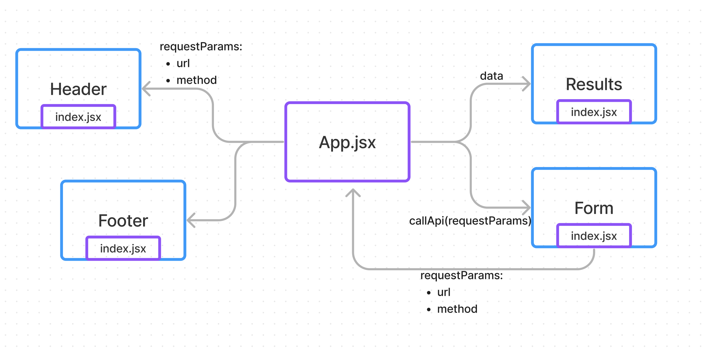

# RESTy

live url: [https://ezgi-c.github.io/resty/](https://ezgi-c.github.io/resty/)

## Lab 26 - Component Based UI

Phase 1 of the RESTy API testing application.

This goal of this lab is to build the basic scaffolding of the application and convert the React classes in the starter code to functional components.

## Lab 27 - `useState()` Hook

Phase 2 of RESTy app.

- Refactor App into a functional component
- Refactor components using `this.setState()` to implement the `useState()` react API hook
- Refactor the Form Component to implement user input from form elements, instead of hard coded string values.

## Lab 28 - Advanced State with Reducers

RESTy phase 4: Track History

- Refactor state management within the App component to use the `useReducer()` hook
- Replace any component state managements to use derived state from `useReducer()` with a reducer function and initial state.

__Major functionality for this phase:__  

 - _As a user, I want to see a list of my previous API calls, so that I can see the results again, quickly._

 `<App />`: Use a reducer to store and manage all application state: loading, results, history.
- Add to history array in state after every api call
    - method, url, results (json).

`<History />`: Iterates the history array in state and shows the previous API calls.
- When one is clicked on, show the results in the results component.
    - Note: the results component renders whatever is in state.

### UML Diagram

[GitHub actions](https://github.com/ezgi-c/resty/actions/)
